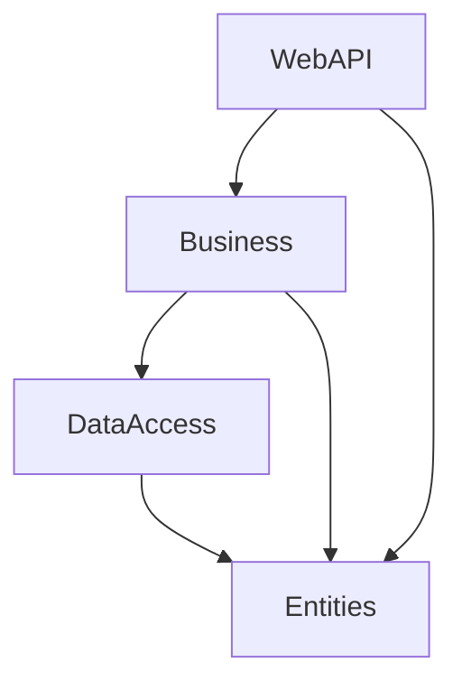

# BabsKitapEvi Projesi Mimari Dokümantasyonu

Bu doküman, BabsKitapEvi projesinin mevcut teknik mimarisini, kullanılan teknolojileri, tasarım desenlerini ve geliştirme standartlarını açıklamaktadır. Projeye yeni özellikler ekleyecek veya mevcut kodu düzenleyecek geliştiriciler için bir rehber niteliğindedir.

## 1. Proje Mimarisi

Proje, sorumlulukların net bir şekilde ayrıldığı klasik bir **N-Katmanlı Mimari (N-Tier Architecture)** kullanılarak tasarlanmıştır. Bu yaklaşım, kodun modüler, sürdürülebilir ve test edilebilir olmasını sağlar.

### Katmanlar

Proje aşağıdaki ana katmanlardan oluşmaktadır:

- **`Entities`**: Projenin temel veri modellerini (örn: `Book`, `AppUser`) ve katmanlar arası veri transferi için kullanılan DTO (Data Transfer Object) nesnelerini içerir. Bu katmanın başka hiçbir katmana bağımlılığı yoktur.
- **`DataAccess`**: Veritabanı işlemlerinden sorumludur. Entity Framework Core `DbContext`'ini, migration'ları ve veritabanı başlangıç verilerini (seed data) içerir.
- **`Business`**: Uygulamanın iş mantığını içerir. Servis arayüzleri (`Interfaces`) ve bu arayüzlerin somut implementasyonlarını (`Services`/`Managers`) barındırır. `DataAccess` katmanını kullanarak veri işlemleri yapar ve sonuçları `WebAPI` katmanına sunar. AutoMapper profilleri de bu katmanda yer alır.
- **`WebAPI`**: Dış dünyaya açılan API endpoint'lerini içerir. Gelen istekleri karşılar, ilgili `Business` katmanı servislerini çağırır ve dönen sonuçları standart bir formatta istemciye sunar. Middleware, kimlik doğrulama ve yetkilendirme yapılandırması bu katmanda yer alır.



## 2. Kullanılan Teknolojiler

- **Backend Framework**: .NET 9
- **API**: ASP.NET Core Web API
- **Veritabanı**: Microsoft SQL Server
- **ORM (Object-Relational Mapping)**: Entity Framework Core
- **Kimlik Yönetimi**: ASP.NET Core Identity
- **Kimlik Doğrulama (Authentication)**: JWT (JSON Web Tokens)
- **Nesne Haritalama (Object Mapping)**: AutoMapper
- **Bağımlılık Enjeksiyonu (Dependency Injection)**: .NET Core'un yerleşik DI konteyneri

## 3. Tasarım Desenleri ve Yöntemler

- **Repository/Service Pattern**: İş mantığı ve veri erişim mantığı, servis ve repository katmanları kullanılarak birbirinden ayrılmıştır. Servisler (`IBookService`, `IUserService` vb.) iş mantığını, `DbContext` ise repository görevini üstlenir.
- **DTO (Data Transfer Object)**: API ve servis katmanları arasında veri taşımak için DTO'lar kullanılır. Bu, veritabanı modellerinin doğrudan dış dünyaya açılmasını engeller ve API kontratını stabil tutar.
- **Dependency Injection (DI)**: Proje genelinde bağımlılıklar, .NET Core'un DI mekanizması ile yönetilir (`Program.cs` içinde `AddScoped`, `AddSingleton` vb.).
- **Asenkron Programlama**: I/O-bound işlemler (veritabanı erişimi, dosya işlemleri vb.) için `async/await` yaygın olarak kullanılır.

## 4. API Standartları

### API Response Yapısı

Tüm API endpoint'leri, tutarlı bir response yapısı sunmak için standart bir zarf (wrapper) kullanır. Bu yapı, istemcinin (frontend) gelen veriyi her zaman aynı formatta beklemesini sağlar.

**Başarılı Response:**

```json
{
  "data": { ... }, // Dönen veri (nesne veya dizi)
  "isSuccess": true,
  "errors": null
}
```

**Hatalı Response:**

```json
{
  "data": null,
  "isSuccess": false,
  "errors": ["Bir veya daha fazla hata mesajı"]
}
```

Bu yapı, `ResponseDto<T>` sınıfı ile sağlanır ve tüm controller'lar `CustomBaseController` üzerinden bu yapıyı kullanır.

### Hata Yönetimi (Error Handling)

- **Global Exception Handler**: `GlobalExceptionHandlerMiddleware`, uygulama genelinde yakalanmamış tüm istisnaları (unhandled exceptions) yakalar ve yukarıda belirtilen standart hata formatında bir response oluşturur.
- **Özelleştirilmiş İstisnalar (Custom Exceptions)**: `NotFoundException`, `InvalidPasswordException` gibi iş mantığına özel hata durumları için özelleştirilmiş exception sınıfları kullanılır. Middleware, bu exception türlerini tanıyarak uygun HTTP status kodlarını (404, 401, 400 vb.) ve hata mesajlarını üretir.

## 5. Yeni Bir Servis Ekleme Rehberi

Projeye yeni bir özellik (örneğin, "Yorumlar" (Comments)) eklenirken aşağıdaki adımlar izlenmelidir:

1.  **Entity Oluşturma**: `Entities/Models` klasörüne `Comment.cs` modelini ekleyin.
2.  **DTO'ları Oluşturma**: `Entities/DTOs` altına `CommentDTOs` klasörü açın ve `CommentDto`, `CreateCommentDto` gibi DTO'ları oluşturun.
3.  **DbContext Güncelleme**: `DataAccess/ApplicationDbContext.cs` içine `public DbSet<Comment> Comments { get; set; }` ekleyin.
4.  **Migration Oluşturma**: `Package Manager Console` üzerinden `Add-Migration AddCommentEntity` ve ardından `Update-Database` komutlarını çalıştırın.
5.  **Servis Katmanı**:
    - `Business/Interfaces` altına `ICommentService.cs` arayüzünü oluşturun.
    - `Business/Services` altına `CommentManager.cs` sınıfını oluşturun ve `ICommentService`'i implemente edin.
6.  **AutoMapper Profili**: `Business/Mappings/AutoMapperProfile.cs` içine `Comment` ve `CommentDto` arasındaki haritalamaları ekleyin.
7.  **Dependency Injection**: `WebAPI/Program.cs` içine `builder.Services.AddScoped<ICommentService, CommentManager>();` satırını ekleyin.
8.  **Controller Oluşturma**: `WebAPI/Controllers` altına `CommentsController.cs`'i oluşturun. Bu controller, `CustomBaseController`'dan miras almalı ve `ICommentService`'i enjekte etmelidir. Tüm action metotları, `CreateActionResultInstance` kullanarak standart response formatında cevap dönmelidir.
